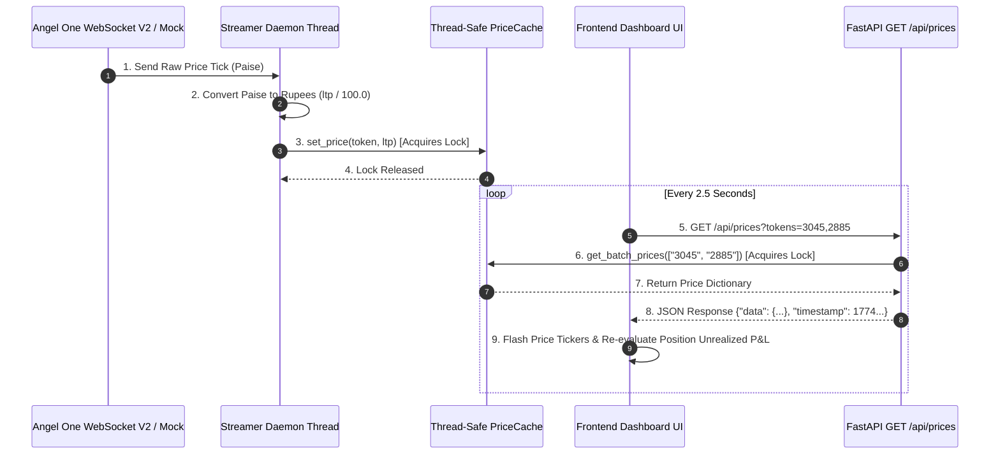
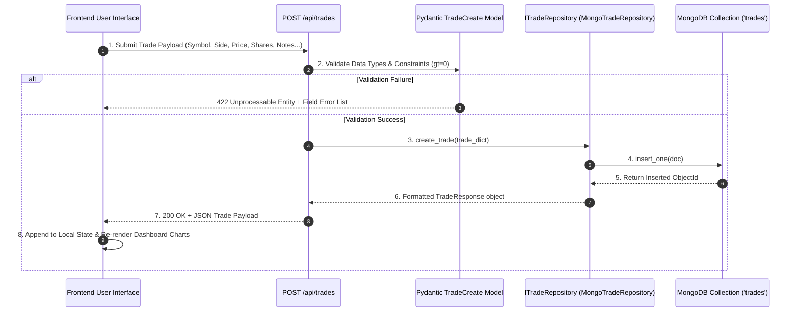
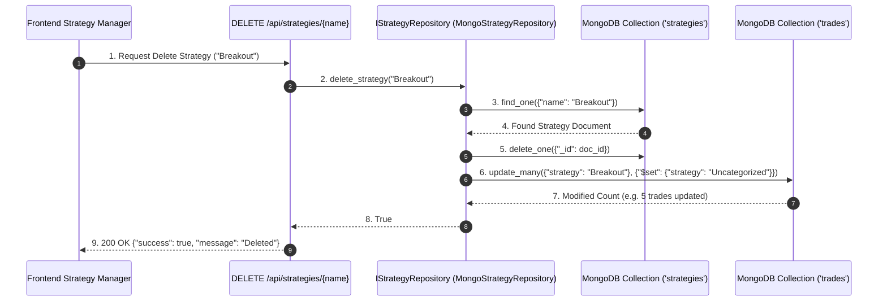
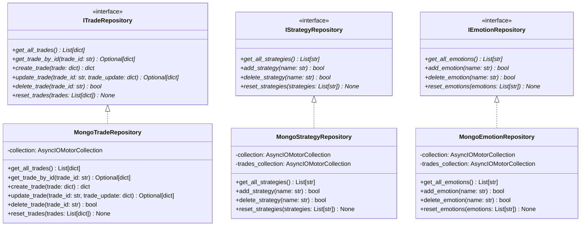
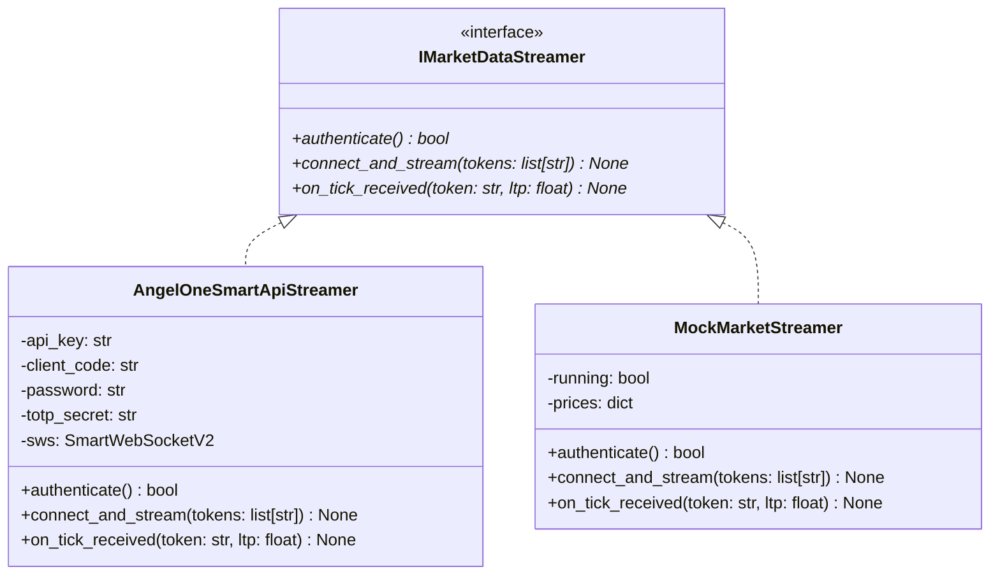

# System Architecture & Low-Level Design (LLD) Master Specification

This document provides a comprehensive technical architecture specification for the Stock Journal application. It details the High-Level Design (HLD), Low-Level Design (LLD), component interaction models, class inheritance structures, sequence workflows, SOLID principles implementation, and database collection schemas.

---

## 1. High-Level Architecture (HLD)

The system is designed as a **Production-Grade Layered Monolith** running inside a single container environment. It integrates real-time WebSocket market tick ingestion, asynchronous non-blocking MongoDB storage, dedicated REST API routers, and static dashboard asset hosting.

### 1.1 Master System Architecture Diagram

```mermaid
graph TD
    subgraph FastAPI Monolith Process (Container)
        A[Lifespan Event] -->|1. Async Motor Connect| B[(MongoDB Database: stock_journal)]
        A -->|2. Spawn Daemon Thread| C[Market Data Streamer Daemon]
        
        C -->|Pushes Ticks| D[Thread-Safe PriceCache]
        
        E[Master APIRouter] --> F[Prices Endpoint /api/prices]
        E --> G[Trades Endpoint /api/trades]
        E --> H[Strategies Endpoint /api/strategies]
        E --> I[Emotions Endpoint /api/emotions]
        E --> J[Journal Endpoint /api/journal]
        
        F -->|Batch Read| D
        G -->|Delegates| K[ITradeRepository Interface]
        H -->|Delegates| L[IStrategyRepository Interface]
        I -->|Delegates| M[IEmotionRepository Interface]
        J -->|Delegates| N[JournalService Orchestrator]
        
        K ..|> O[MongoTradeRepository]
        L ..|> P[MongoStrategyRepository]
        M ..|> Q[MongoEmotionRepository]
        
        O -->|Async Motor Queries| B
        P -->|Async Motor Queries| B
        Q -->|Async Motor Queries| B
        
        R[StaticFiles Engine] -->|Serves Assets| S[Client Dashboard UI: static/]
    end

    S -->|2.5s Price Poll| F
    S -->|AJAX Fetch / REST CRUD| E
```

---

## 2. Sequence Workflows & Execution Diagrams

### 2.1 Market Tick Ingestion & Live Price Cache Workflow


### 2.2 Trade Creation & Data Validation Workflow


### 2.3 Strategy Deletion & Cascading Reassignment Workflow


---

## 3. Class & Inheritance Architecture

### 3.1 Persistence Layer Class Diagram


### 3.2 Market Streaming Class Diagram


---

## 4. SOLID Principles Mapping & Architectural Proofs

### Single Responsibility Principle (SRP)
- **Proof**: `app/core/database.py` manages **only** MongoDB connection initialization and closure. It contains zero SQL/BSON queries or routing logic. `app/streaming/price_cache.py` manages **only** thread-safe in-memory price storage.

### Open/Closed Principle (OCP)
- **Proof**: `IMarketDataStreamer` defines the streaming abstraction. Adding support for a new market data provider (e.g. `ZerodhaStreamer` or `InteractiveBrokersStreamer`) requires adding a new class implementing `IMarketDataStreamer` — **zero** changes to `price_cache.py` or `/api/prices` endpoints!

### Liskov Substitution Principle (LSP)
- **Proof**: Both `AngelOneSmartApiStreamer` and `MockMarketStreamer` can be substituted into the background daemon thread transparently without the caller caring which implementation is running.

### Interface Segregation Principle (ISP)
- **Proof**: Instead of creating a bloated `IGenericJournalRepository` with 30 methods, data access is divided into concise contracts: `ITradeRepository`, `IStrategyRepository`, and `IEmotionRepository`.

### Dependency Inversion Principle (DIP)
- **Proof**: `JournalService` in `app/services/journal_service.py` accepts `trade_repo: ITradeRepository`, `strategy_repo: IStrategyRepository`, and `emotion_repo: IEmotionRepository` in its constructor. It never imports `MongoTradeRepository` directly! FastAPI injects dependencies using `Depends()`.

---

## 5. MongoDB Database Schemas

### Database: `stock_journal`

#### Collection 1: `trades`
```json
{
  "_id": ObjectId("669ea102f..."),
  "custom_id": "trade_1",
  "symbol": "AAPL",
  "side": "BUY",
  "price": 182.50,
  "stopLoss": 178.00,
  "shares": 50,
  "pfMatrix": 1.5,
  "rsMatrix": 1.2,
  "xPercentage": 5.0,
  "strategy": "Breakout",
  "emotion": "Disciplined",
  "mistakes": ["None"],
  "notes": "AAPL breakout above $182 resistance level.",
  "date": "2026-07-01T14:30:00Z"
}
```

#### Collection 2: `strategies`
```json
{
  "_id": ObjectId("669ea109a..."),
  "name": "Breakout"
}
```

#### Collection 3: `emotions`
```json
{
  "_id": ObjectId("669ea110c..."),
  "name": "Disciplined"
}
```

---

## 6. Security, Environment Resolution & Deployment Topology

### 6.1 CORS Security Policy (`ALLOWED_ORIGINS`)
FastAPI mounts `CORSMiddleware` configured dynamically via `Settings.get_allowed_origins()` in `app/core/config.py`.
- **Development**: Accepts wildcard `*` or `http://localhost:8000`.
- **Production**: Accepts comma-separated domain whitelists defined via the `ALLOWED_ORIGINS` environment variable (e.g. `https://your-app.vercel.app,http://localhost:8000`).

### 6.2 Frontend Dynamic API Resolution (`FASTAPI_BACKEND_URL`)
Frontend assets (`static/state.js`, `static/mockApi.js`, `static/index.html`) dynamically resolve the target backend endpoint using the following fallback chain:
1. `window.FASTAPI_BACKEND_URL` (injected via Vercel Environment Variables or script configuration).
2. `window.API_BASE_URL` (legacy fallback).
3. Relative URL `""` (used when the frontend is served directly by FastAPI on Render).

### 6.3 Vercel Schema Compliance (`vercel.json`)
The Vercel deployment configuration enforces strict compliance with Vercel v2 schema rules:
```json
{
  "cleanUrls": true,
  "rewrites": [
    {
      "source": "/(.*)",
      "destination": "/static/$1"
    }
  ]
}
```

